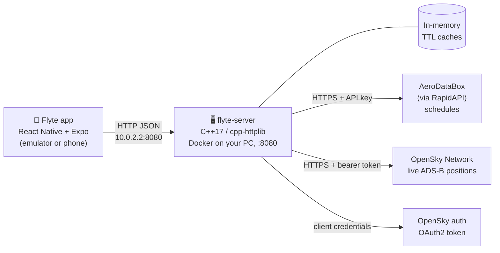
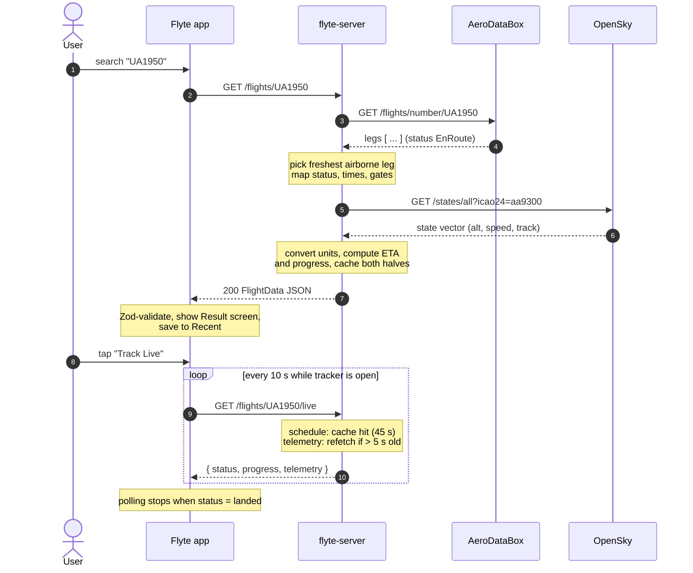
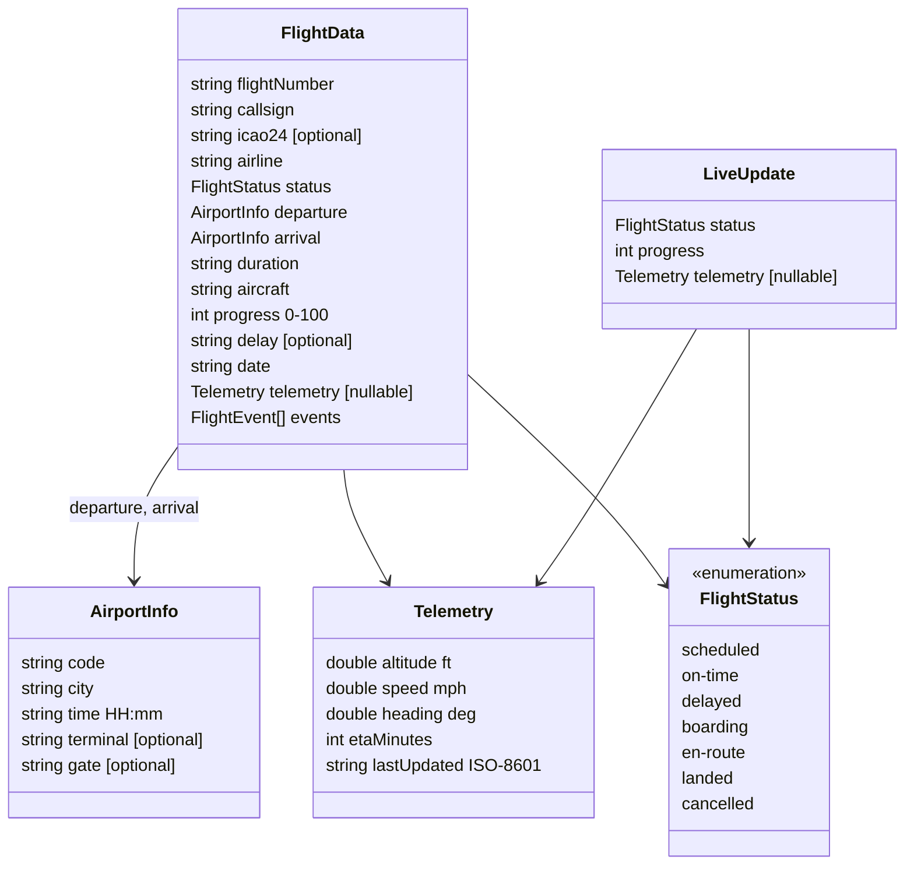

# Flyte architecture

How the codebase is organised and how the app works end to end. For setup and
run instructions, see the [project README](../README.md).

| Document | Covers |
|---|---|
| [server.md](server.md) | The C++ backend: request flow, the two API clients, merging, caching, the Docker build |
| [frontend.md](frontend.md) | The React Native app: screens, the data layer, polling, persistence, components |

This page covers the parts that span both: the system as a whole and the API
contract between them.

---

## The system at a glance



Three things to take from this:

1. **The app never talks to a third-party API directly.** API keys can't safely
   ship inside a mobile app, so every request goes through the backend.
2. **The backend combines two sources.** No free API gives both schedule data
   (route, gates, status) and live position (altitude, speed, heading).
   AeroDataBox provides the first and OpenSky the second. The backend joins them
   into one response.
3. **Caching is essential here.** Both APIs are free-tier limited. The server
   caches schedules for 45 s and positions for 5 s, so a phone polling every
   10 s barely touches the upstream quotas.

## One search, end to end

What happens when you type `UA1950` and tap search, then open the live tracker:



## The API contract

The one interface both halves depend on. It is defined **twice**, once per
language, and the two must match field for field:

| Side | File |
|---|---|
| Server (C++) | `server/src/models/flight_data.h` (structs) + `flight_data_json.h` (JSON) |
| App (TypeScript) | `src/types/flight.ts` (Zod schemas; TS types are inferred from them) |

There is no compile-time link between them. The safety net is at runtime: the
app validates every response against the Zod schema, so a mismatch shows up as
a clear "Unexpected response from the server" error instead of broken UI.



| Endpoint | Returns | Used by |
|---|---|---|
| `GET /flights/:flightNumber` | `FlightData`, or `404 { "error": "Flight not found" }` | Search |
| `GET /flights/:flightNumber/live` | `LiveUpdate`, or `404` | Live tracker polling |

`telemetry: null` is a normal value, not an error. It means the flight is on the
ground or OpenSky currently has no position for it (for example over an ocean).

**Changing the contract?** Update `flight_data.h`, `flight_data_json.h` and
`src/types/flight.ts` together, then run `npx tsc --noEmit`.

## Repository map

```
Flyte/
├── README.md          setup & run instructions
├── doc/               ← you are here
├── src/               the React Native app         → frontend.md
├── server/            the C++ backend              → server.md
├── index.js           app entry point
├── app.json           Expo config (name, package id, plugins)
├── package.json       JS dependencies
├── babel.config.js, metro.config.js, tailwind.config.js, global.css
│                      build tooling for NativeWind / Tailwind styling
└── android/           generated by `expo prebuild` (git-ignored)
```
