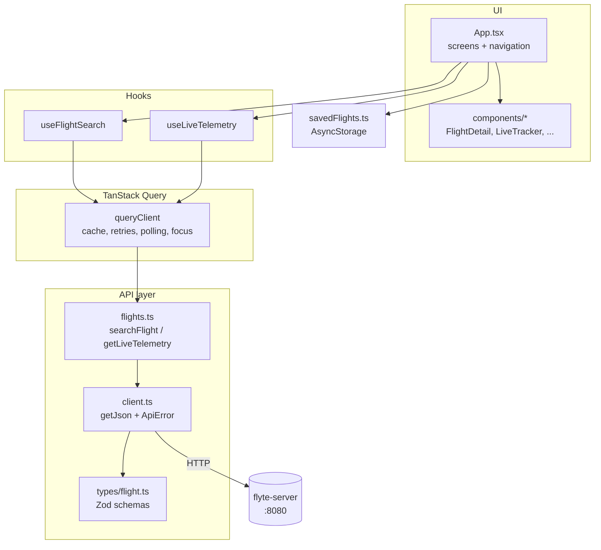
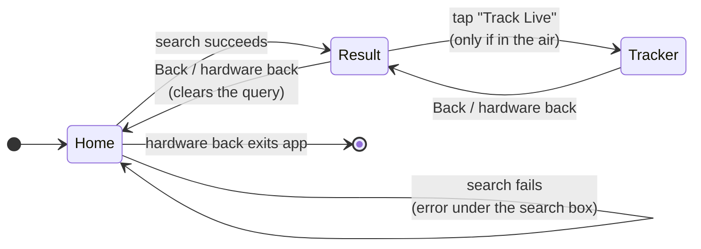
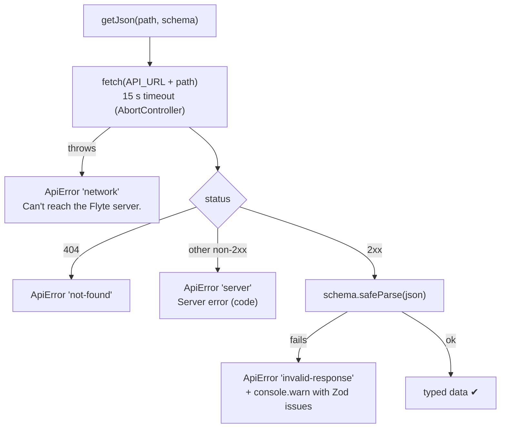
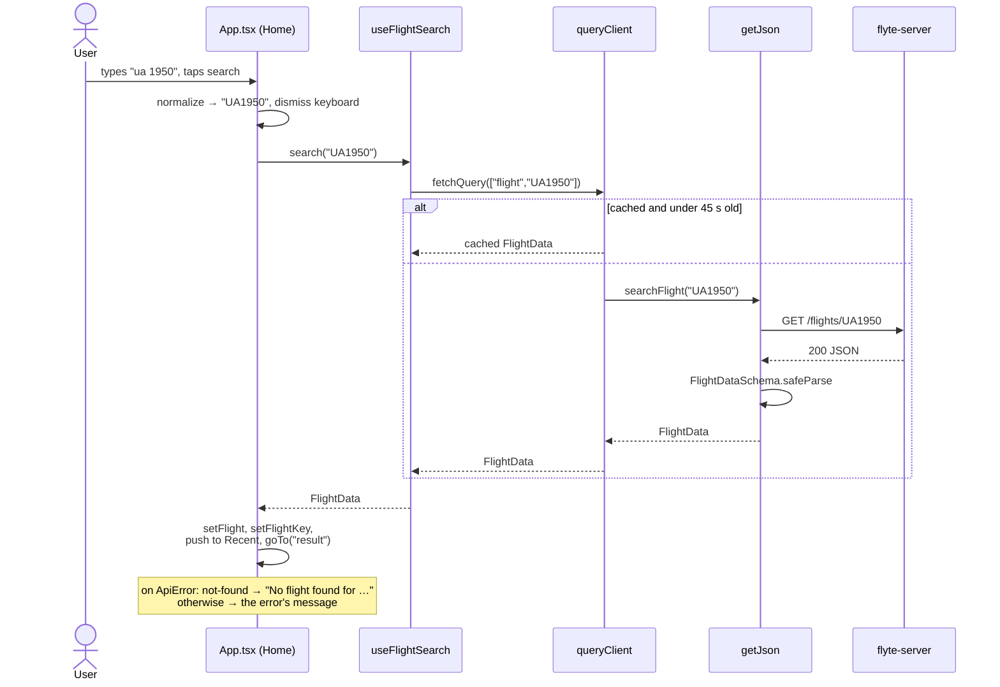
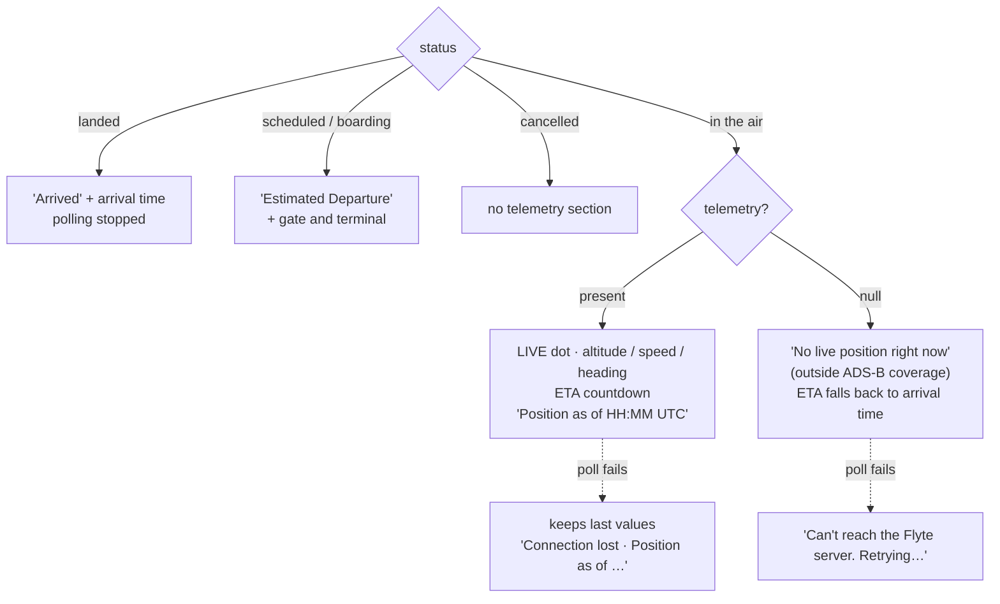
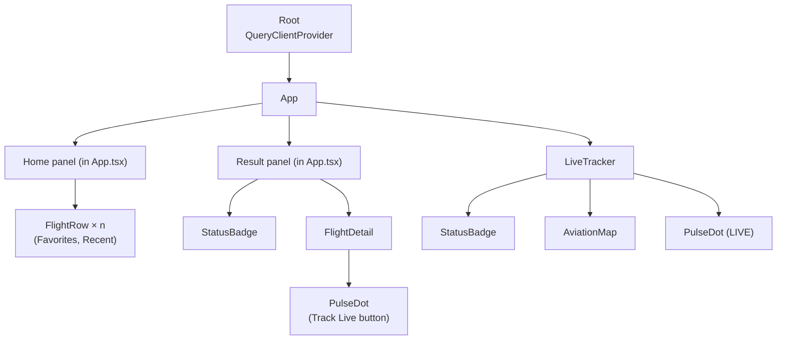
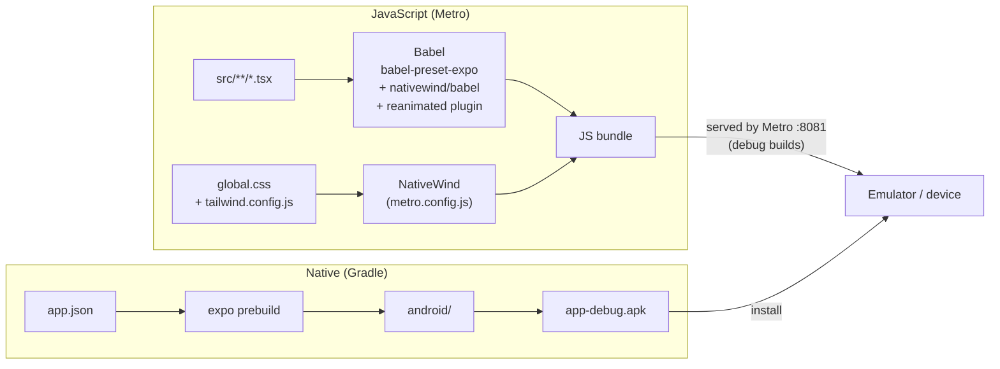

# Frontend (React Native app)

The app lives in `src/`. It is a single-activity React Native app built with
Expo: three screens (Home → Result → Live tracker), a small data layer that
talks to the backend, and persisted Favorites/Recent lists.

← [Server](server.md) · [Architecture index](README.md)

---

## Contents

1. [Tech stack](#tech-stack)
2. [File layout](#file-layout)
3. [Layers](#layers)
4. [Screens and navigation](#screens-and-navigation)
5. [State in App.tsx](#state-in-apptsx)
6. [Data layer](#data-layer)
7. [Search flow](#search-flow)
8. [Live tracking flow](#live-tracking-flow)
9. [Favorites and Recent](#favorites-and-recent)
10. [Components](#components)
11. [Styling](#styling)
12. [Build pipeline](#build-pipeline)

---

## Tech stack

| Piece | Choice | Role |
|---|---|---|
| Framework | React Native 0.79 + React 19 | UI |
| Tooling | Expo SDK 53 | Native project generation, Metro bundler, modules |
| Server state | TanStack Query v5 | Fetching, caching, polling |
| Validation | Zod | Runtime checks on every API response; TS types inferred from schemas |
| Styling | NativeWind 4 (Tailwind for RN) | `className="..."` on native views |
| Graphics | react-native-svg | Route map |
| Icons | lucide-react-native | All icons |
| Storage | AsyncStorage | Favorites and Recent |
| Animation | RN `Animated` | Screen slides, pulsing dots |

## File layout

```
index.js                        registerRootComponent(App)
src/
├── App.tsx                     root: providers, screen state machine, Home + Result UI
├── theme.ts                    raw colours for icon/SVG props (mirror of tailwind.config.js)
├── types/
│   └── flight.ts               Zod schemas = the API contract (see README.md)
├── lib/
│   ├── api/
│   │   ├── client.ts           getJson(): fetch + timeout + status → ApiError + Zod parse
│   │   └── flights.ts          searchFlight(), getLiveTelemetry(), normalizeFlightNumber()
│   ├── hooks/
│   │   ├── useFlightSearch.ts  imperative search through the query cache
│   │   └── useLiveTelemetry.ts polling query for /live
│   ├── queryClient.ts          QueryClient + retry policy + AppState focus wiring
│   └── savedFlights.ts         Favorites / Recent persistence
└── components/
    ├── FlightDetail.tsx        Result screen body
    ├── LiveTracker.tsx         Live tracker screen
    ├── AviationMap.tsx         SVG route arc with plane marker
    ├── FlightRow.tsx           row in Favorites / Recent
    ├── StatusBadge.tsx         coloured status pill
    └── PulseDot.tsx            animated "live" dot
```

## Layers

Each layer only talks to the one below it. Components never call `fetch`, and
the API layer knows nothing about screens.



## Screens and navigation

There's no navigation library. The three screens sit side by side in one
horizontal row, three screen-widths wide, and `goTo()` slides that row with an
`Animated.timing` translate (350 ms).



```
 ┌──────────────┬──────────────┬──────────────┐
 │     HOME     │    RESULT    │   TRACKER    │   ← one Animated.View, width = 3 × screen
 └──────────────┴──────────────┴──────────────┘
   translateX:  0          −W            −2W
```

Because all three screens stay mounted, the tracker's content exists (off
screen) as soon as a search succeeds. Its **polling**, however, only runs while
`screen === "tracker"`.

The Android hardware back button is handled with `BackHandler`: it goes back one
screen, and on Home it falls through so the app exits normally.

## State in App.tsx

All UI state lives in the root component. Server data lives in TanStack Query.

| State | Type | Purpose |
|---|---|---|
| `query` | `string` | Search box text (uppercased as you type) |
| `screen` | `"home" \| "result" \| "tracker"` | Which screen is showing |
| `flight` | `FlightData \| null` | The last successful search result |
| `flightKey` | `string \| null` | Normalized flight number (`"UA1950"`), used for `/live` |
| `searchError` | `string \| null` | Message shown under the search box |
| `favorites` | `SavedFlight[]` | Starred flights (persisted) |
| `recents` | `SavedFlight[]` | Last 5 searches (persisted) |
| `searching` | from `useFlightSearch` | Spinner on the search button |
| `live` | from `useLiveTelemetry` | `{ data, isError, ... }` from polling |

## Data layer

### `lib/api/client.ts`: one function, four outcomes



**Which backend?** `API_URL` is `EXPO_PUBLIC_API_URL` if set (Expo bakes it in
at bundle time); otherwise `http://10.0.2.2:8080` on Android, which is the
emulator's alias for the host PC's `localhost`, and `http://localhost:8080`
elsewhere.

### `lib/queryClient.ts`

- **Retry policy.** Never retry a `not-found` (it won't change); retry other
  failures once.
- **Focus.** React Native has no browser "window focus", so `AppState` is wired
  into TanStack Query's `focusManager`. When the app goes to the background the
  query client treats it as unfocused, which pauses the live polling.

### Hooks

| Hook | Style | Query key | Behaviour |
|---|---|---|---|
| `useFlightSearch()` | Imperative: returns `search(raw)` + `isSearching` | `["flight", KEY]` | `queryClient.fetchQuery` with `staleTime` 45 s (matches the server cache), so re-searching the same flight within 45 s needs no request |
| `useLiveTelemetry(key, enabled)` | Declarative `useQuery` | `["live", KEY]` | `enabled` only on the tracker screen; `refetchInterval` 10 s, switching to `false` once status is `landed`/`cancelled` |

Search is imperative because the UI has to act on the result: navigate on
success, or show an error. It still goes through the query cache, so results are
shared and deduplicated.

## Search flow



## Live tracking flow

The tracker combines the last search result with the latest `/live` poll.
Whichever is fresher wins:

```ts
const status    = live?.status   ?? flight.status;
const progress  = live?.progress ?? flight.progress;
const telemetry = live ? live.telemetry : flight.telemetry;
```



**When is "Track Live" enabled?** In `FlightDetail`, for a flight that is
neither landed nor cancelled **and** has progress > 0, status `en-route`, or
telemetry. The extra conditions cover AeroDataBox's `Departed` status, which
arrives as `on-time`/`delayed`.

**Progress of 0 for a flight in the air** means the backend couldn't compute
it. The Result screen shows "Progress unavailable" and the tracker shows "—",
rather than a made-up number.

## Favorites and Recent

Both lists persist in AsyncStorage as small **snapshots**, not full flight
data:

```ts
interface SavedFlight {
  key: string;          // "AA2847"  (normalized, used to re-search)
  flightNumber: string; // "AA 2847" (display)
  airline: string;
  from: string;         // "JFK"
  to: string;           // "LAX"
}
```

| List | Storage key | Rules |
|---|---|---|
| Favorites | `flyte-favorites-v2` | Toggled with the ☆ on the Result screen |
| Recent | `flyte-recents` | Every successful search; newest first, deduplicated, max 5; hidden if already a favourite |

Snapshots deliberately leave out **status**, which would be stale by the time
you look at the list. Tapping a row runs a fresh search. `v2` in the key
exists because v1 stored keys into the old mock data; `savedFlights.ts` deletes
that old key on startup.

## Components



| Component | Props | Notes |
|---|---|---|
| `FlightDetail` | `flight`, `onTrack` | Route header, progress bar, departure/arrival cards, info grid, delay banner, Track Live button. Missing terminal/gate show "—". |
| `LiveTracker` | `flight`, `live`, `liveFailed`, `onBack` | Map, telemetry cells, ETA card, progress bar; flight log hidden while `events` is empty |
| `AviationMap` | `flight`, `progress` | A schematic SVG arc in a 360×160 viewBox; plane placed along a quadratic Bézier by progress. **Not geographic.** Sized by the wrapper's `aspectRatio`; a percentage `height` on the `Svg` inside a ScrollView blows up to full screen. |
| `StatusBadge` | `status` | One colour + icon per `FlightStatus` (`en-route` = green plane, `delayed` = amber, …) |
| `FlightRow` | `flight: SavedFlight`, `variant` | No status badge, since saved status would be stale |
| `PulseDot` | `size`, `color`, `haloOpacity` | Looping `Animated` scale + fade halo |

## Styling

- **NativeWind** compiles Tailwind classes (`className="bg-card rounded-2xl p-4"`)
  into React Native styles at build time. The colour tokens (`background`,
  `card`, `primary`, `secondary`, `muted-foreground`, `border`) live in
  `tailwind.config.js`.
- **`theme.ts`** repeats the few colours that must be passed as raw values, such
  as icon `color` props and SVG fills, because those can't take a `className`.
  Keep the two in sync.
- Dark theme only; the fonts are system defaults with `monospace` for flight
  numbers and times.

## Build pipeline



- **Two halves.** Gradle builds the native shell, which changes rarely. Metro
  serves the JavaScript, which is what you edit, and pressing `r` reloads it
  without a native rebuild.
- **`android/` is generated.** It's never edited by hand or committed. Rebuild
  it with `expo prebuild` after changing `app.json` or adding a native
  dependency, and recreate `android/local.properties` each time.
- **Debug builds allow plain `http://`,** which is how the app reaches the local
  backend. A release build would need HTTPS or a cleartext exception.
- **Load-bearing dependency pins** (don't "tidy" them): `nativewind` exactly
  `4.1.23`, and the explicit `expo-*` modules in `package.json`. The project
  README explains why.
