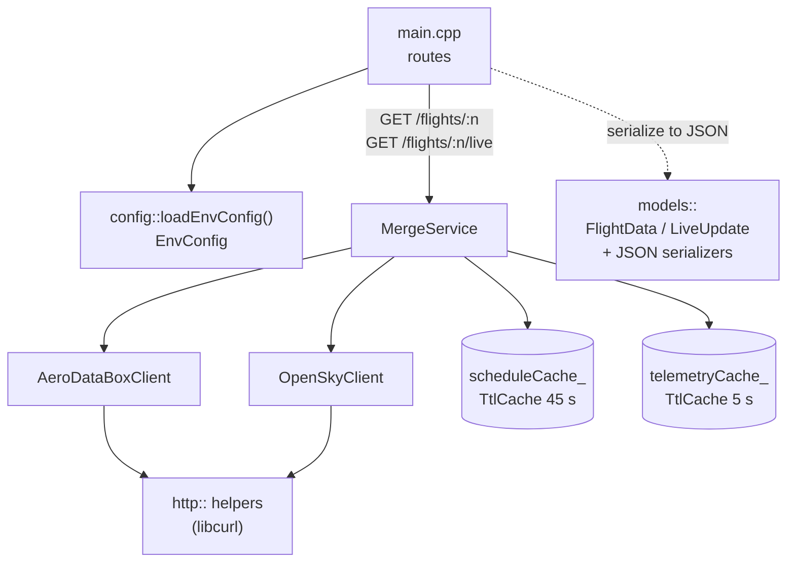
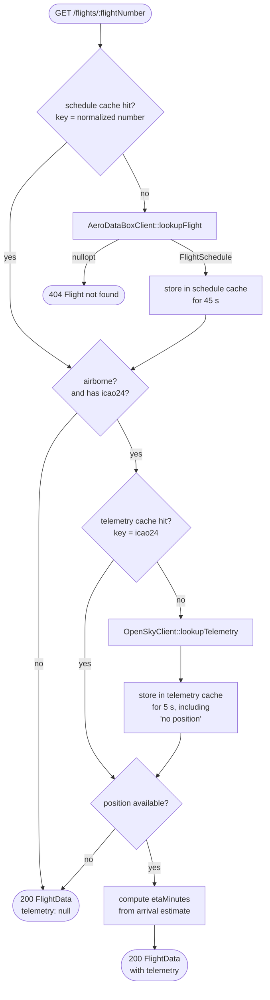
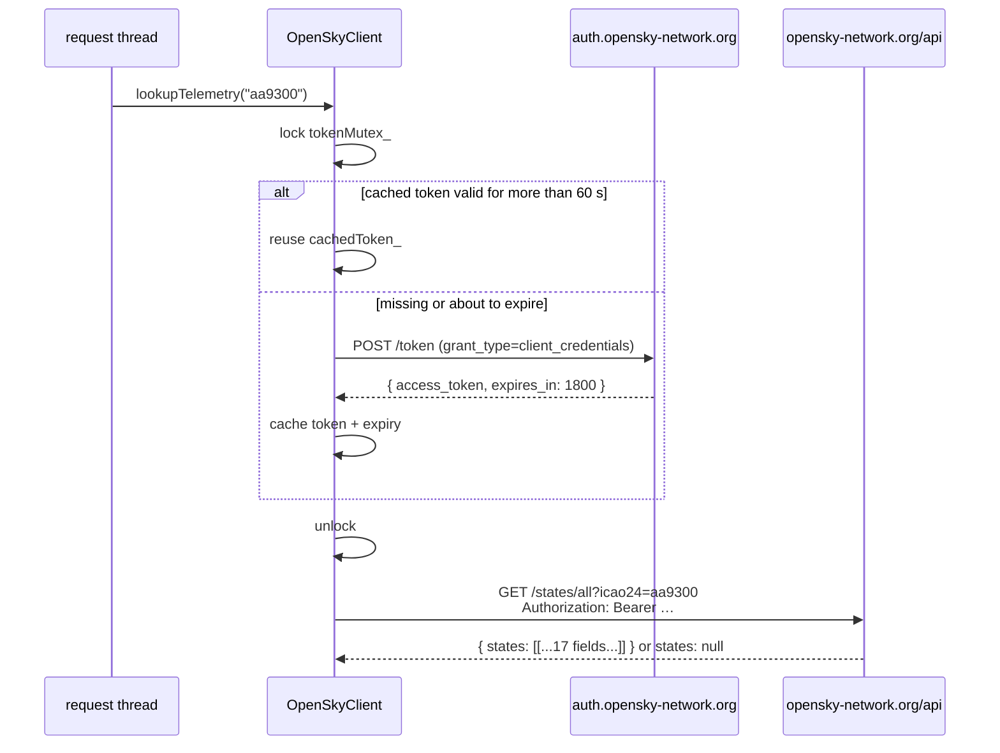
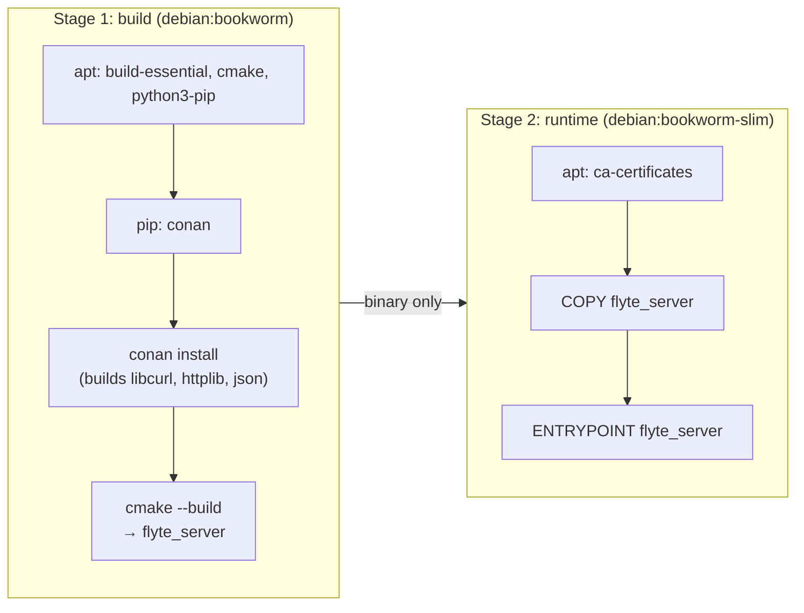

# Server (C++ backend)

`server/` is a small C++17 HTTP service. It holds the API credentials, fetches
flight data from two third-party APIs, merges it into one response, and caches
aggressively so the free tiers last. It always runs inside Docker.

← [Architecture index](README.md) · [Frontend](frontend.md) →

---

## Contents

1. [Tech stack](#tech-stack)
2. [File layout](#file-layout)
3. [How the pieces fit](#how-the-pieces-fit)
4. [Request lifecycle](#request-lifecycle)
5. [AeroDataBox client: schedules](#aerodatabox-client-schedules)
6. [OpenSky client: live positions](#opensky-client-live-positions)
7. [Merge service: combining the two](#merge-service-combining-the-two)
8. [Caching](#caching)
9. [Configuration](#configuration)
10. [Build and runtime (Docker)](#build-and-runtime-docker)
11. [Error handling and logging](#error-handling-and-logging)
12. [Concurrency](#concurrency)

---

## Tech stack

| Piece | Choice | Why |
|---|---|---|
| Language | C++17 | Project preference |
| HTTP server | [cpp-httplib](https://github.com/yhirose/cpp-httplib) | Header-only; right-sized for two endpoints |
| Outbound HTTPS | libcurl | Solid TLS; handles OpenSky's form-encoded OAuth2 POST |
| JSON | nlohmann/json | Readable (de)serialization with typed structs |
| Dependencies | Conan 2 | Fetches and builds the three libraries above |
| Build | CMake | Driven by Conan's generated toolchain |
| Runtime | Docker (Debian bookworm) | One Linux toolchain; no Windows/MSVC build to maintain |

## File layout

```
server/
├── Dockerfile               multi-stage: build → slim runtime
├── docker-compose.yml       local dev: bind-mounted src/, cached build volume
├── .dockerignore            keeps .env and build/ out of the build context
├── conanfile.py             cpp-httplib, nlohmann_json, libcurl
├── CMakeLists.txt           one executable: flyte_server
├── .env.example             template for the three credentials
└── src/
    ├── main.cpp                         wiring + the two HTTP routes
    ├── config/
    │   └── env_config.h/.cpp            reads PORT and the credentials
    ├── models/
    │   ├── flight_data.h                FlightData, Telemetry, LiveUpdate, ...
    │   └── flight_data_json.h           to_json / from_json for each struct
    ├── services/
    │   ├── aerodatabox_client.h/.cpp    schedule lookup + mapping
    │   ├── opensky_client.h/.cpp        OAuth2 token + position lookup
    │   ├── merge_service.h/.cpp         combines both, ETA, owns the caches
    │   └── http_client.h/.cpp           shared libcurl GET / form-POST helpers
    └── cache/
        └── ttl_cache.h                  generic thread-safe TTL cache
```

## How the pieces fit

`main()` builds everything once at startup and hands references down. There are
no globals and no singletons.



```cpp
// main.cpp (abridged)
config::EnvConfig cfg = config::loadEnvConfig();          // throws if a key is missing
services::AeroDataBoxClient aeroDataBox(cfg.aerodataboxKey);
services::OpenSkyClient openSky(cfg.openskyClientId, cfg.openskyClientSecret);
services::MergeService mergeService(aeroDataBox, openSky);

svr.Get("/flights/:flightNumber", ...);        // mergeService.lookupFlight(n)
svr.Get("/flights/:flightNumber/live", ...);   // mergeService.lookupLive(n)
svr.listen("0.0.0.0", cfg.port);
```

The routes are thin. They pull `:flightNumber` from the path, call the merge
service, and either serialize the result or return
`404 {"error":"Flight not found"}`.

## Request lifecycle

The full path of `GET /flights/:flightNumber` through `MergeService::lookupFlight`:



`GET /flights/:flightNumber/live` runs exactly the same path
(`lookupLive` calls `lookupFlight`) and then returns only
`{ status, progress, telemetry }`. Polling is cheap because the schedule is
almost always a cache hit.

## AeroDataBox client: schedules

`services/aerodatabox_client.cpp` turns a flight number into the schedule half
of the response.

**Request.** `GET https://aerodatabox.p.rapidapi.com/flights/number/{n}` with
the `x-rapidapi-key` header. It returns a JSON **array** of legs.

**Choosing a leg.** One flight number often returns several legs: yesterday's
landed flight, today's, and sometimes a stale `Departed` duplicate of today's
`EnRoute` leg. The client picks the **most recently updated airborne leg**
(`lastUpdatedUtc`), falling back to the first entry.

**Output.** A `FlightSchedule`:

```cpp
struct FlightSchedule {
    models::FlightData flight;                // everything except telemetry
    std::optional<time_point> arrivalUtc;     // best arrival estimate, for ETA
    bool airborne;                            // should we ask OpenSky?
};
```

### Status mapping

AeroDataBox has 12+ status codes; the app has 7.

| AeroDataBox `status` | → `FlightStatus` | Airborne? |
|---|---|---|
| `EnRoute`, `Approaching` | `en-route` | ✅ |
| `Departed` | `on-time` (or `delayed`, see below) | ✅ |
| `CheckIn`, `Boarding`, `GateClosed` | `boarding` | |
| `Delayed`, `Diverted`, `CanceledUncertain` | `delayed` | |
| `Arrived` | `landed` | |
| `Canceled`, `Cancelled` | `cancelled` | |
| `Unknown`, `Expected`, anything new | `scheduled` | |

If the departure is more than 10 minutes behind schedule, an `on-time` status
is upgraded to `delayed`.

"Airborne" is decided from the **raw** status, before mapping, because
`Departed` collapses into `on-time`/`delayed`, which on its own wouldn't tell us
the plane is flying.

### Derived fields

AeroDataBox gives timestamps. Everything else is computed:

| Field | How |
|---|---|
| `departure/arrival.time` | Local `HH:mm` from revised → predicted → scheduled time |
| `duration` | Scheduled arrival − scheduled departure, as `"5h 15m"` |
| `delay` | Revised − scheduled departure when > 10 min, as `"29m"` / `"1h 5m"` |
| `progress` | 100 if landed; 0 if not airborne; otherwise elapsed ÷ total between the **actual takeoff** (`runwayTime`) and the **live arrival prediction**. 0 if those times are missing. |
| `date` | Departure date as `"Thu, 24 Sep"` |
| `callsign` | AeroDataBox `callSign`, or airline ICAO + digits (`AA2847` → `AAL2847`) |
| `icao24` | `aircraft.modeS`, the transponder code OpenSky is keyed by |

Every timestamp read is tolerant of missing blocks. Legs that are in the air
sometimes carry only `predictedTime` for arrival and no `scheduledTime`.

## OpenSky client: live positions

`services/opensky_client.cpp` turns an ICAO24 code into a `Telemetry`.

### OAuth2 token

OpenSky uses the OAuth2 client-credentials flow. The token is cached and reused
until 60 seconds before it expires:



The mutex matters: cpp-httplib serves requests on a thread pool, and without it
two simultaneous requests could both try to refresh the token at once.

### Mapping a state vector

OpenSky returns each aircraft as a positional array. The fields used:

| Index | OpenSky field | → `Telemetry` | Conversion |
|---|---|---|---|
| 7 | `baro_altitude` (m) | `altitude` (ft) | × 3.28084; falls back to index 13 `geo_altitude` |
| 9 | `velocity` (m/s) | `speed` (mph) | × 2.23694 (ground speed) |
| 10 | `true_track` (°) | `heading` (°) | none |
| 3 / 4 | `time_position` / `last_contact` (unix s) | `lastUpdated` | ISO-8601 UTC |

`states: null` or no altitude means **no position right now** (out of receiver
range, or not transmitting). The client returns `nullopt` and the response
carries `telemetry: null`.

OpenSky has no ETA, so the client leaves `etaMinutes` at 0 and the merge service
fills it in.

## Merge service: combining the two

`services/merge_service.cpp` is the only place that knows about both APIs.

- **Gating.** It calls OpenSky only when `airborne && icao24`, so flights on the
  ground never cost OpenSky quota.
- **ETA.** `etaMinutes = max(0, arrivalUtc − now)`, computed **per request**
  rather than cached, so the countdown stays current while the schedule is
  served from a 45-second-old cache entry.
- **Live view.** `lookupLive()` reuses `lookupFlight()` and returns
  `LiveUpdate { status, progress, telemetry }`.

## Caching

`cache/ttl_cache.h` is a small generic class template:

```cpp
template <typename Key, typename Value>
class TtlCache {
public:
    explicit TtlCache(duration ttl, size_t maxEntries = 1024);
    std::optional<Value> get(const Key&);   // drops the entry if expired
    void put(const Key&, Value);            // purges expired entries when full
};
```

- **Lazy expiry.** Stale entries are removed when read. There's no background
  thread.
- **Bounded.** Once the map reaches 1,024 entries, `put()` sweeps out expired
  ones, so keys that are never read again can't pile up.
- **`steady_clock`,** so wall-clock changes can't make entries live forever or
  expire early.
- **Mutex-guarded** for the thread pool.

| Cache | Key | TTL | What's stored | Not stored |
|---|---|---|---|---|
| Schedule | Flight number, uppercased, spaces removed (`"sq 21"` → `"SQ21"`) | 45 s | `FlightSchedule` | Misses. An AeroDataBox 429 rate limit looks like a miss, and caching it would give 45 s of false 404s. |
| Telemetry | `icao24` | 5 s | `optional<Telemetry>`, **including** "no position" | — |

The effect on the free tiers, with one phone polling `/live` every 10 s for a
flight in the air:

| Time | App polls `/live` | AeroDataBox (45 s cache) | OpenSky (5 s cache) |
|---|---|---|---|
| 0 s | ✔ | **called** | **called** |
| 10 s | ✔ | cache hit | **called** (entry is 10 s old) |
| 20 s | ✔ | cache hit | **called** |
| 30 s | ✔ | cache hit | **called** |
| 40 s | ✔ | cache hit | **called** |
| 50 s | ✔ | **called** (entry expired at 45 s) | **called** |

AeroDataBox is hit about once a minute rather than six times. OpenSky's 5 s TTL
mostly protects against several users, or a search plus the tracker, asking
for the same aircraft at the same moment.

## Configuration

`config/env_config.cpp` reads environment variables at startup (from
`server/.env` via Docker Compose):

| Variable | Required | Default | Used by |
|---|---|---|---|
| `PORT` | no | `8080` | `svr.listen` |
| `AERODATABOX_KEY` | **yes** | — | `x-rapidapi-key` header |
| `OPENSKY_CLIENT_ID` | **yes** | — | OAuth2 token request |
| `OPENSKY_CLIENT_SECRET` | **yes** | — | OAuth2 token request |

A missing required variable throws `std::runtime_error` and the server exits
immediately rather than failing on the first request.

## Build and runtime (Docker)



- **Local development** (`docker compose up`) runs the **build** stage, with
  `server/src/` bind-mounted and the build output in a named volume. Editing
  C++ and running `docker compose restart` recompiles incrementally.
- **The build volume goes stale.** It's filled from the image only once. After
  changing `conanfile.py`, `CMakeLists.txt` or the `Dockerfile`, run
  `docker compose down -v` first.
- **The runtime stage** is what would ship. It has no compiler, just the binary
  plus CA certificates, which libcurl needs to verify HTTPS. Compose doesn't
  exercise this stage, so test it with `docker build` + `docker run` (see the
  project README).

## Error handling and logging

The server never crashes on bad upstream data; every failure degrades to a
clear response:

| Failure | Where caught | Result |
|---|---|---|
| Network error / non-200 from an API | `http::get` / `http::postForm` | Logged, returns `nullopt` |
| AeroDataBox 204 (no such flight) or 429 (rate limit) | same | `404` to the app |
| Unexpected JSON shape | `catch (nlohmann::json::exception&)` in each client | Logged with `e.what()`, treated as not found |
| OpenSky token or states failure | `OpenSkyClient` | `telemetry: null`; the schedule is still returned |

Logs go to stderr, so they appear in `docker compose logs`. Each line is prefixed
with its source, for example:

```
[AeroDataBoxClient] request failed: curl=No error httpCode=429 body={"message":"You have exceeded the rate limit per second ..."}
[OpenSkyClient] states request failed: curl=... httpCode=401 ...
[AeroDataBoxClient] response shape unexpected: [json.exception.type_error.302] ...
```

Successful requests aren't logged.

## Concurrency

cpp-httplib handles each connection on a worker from a thread pool, so several
requests can run inside `MergeService` at once. Shared state is kept minimal and
guarded:

| Shared state | Guard |
|---|---|
| OpenSky access token + expiry | `OpenSkyClient::tokenMutex_` |
| Schedule cache | `TtlCache` internal mutex |
| Telemetry cache | `TtlCache` internal mutex |

Everything else is either immutable after startup (config, API keys) or local
to the request. Two requests for the same uncached flight at the same instant
will both call upstream. That's harmless at this scale, and the cache absorbs
everything after the first response.
